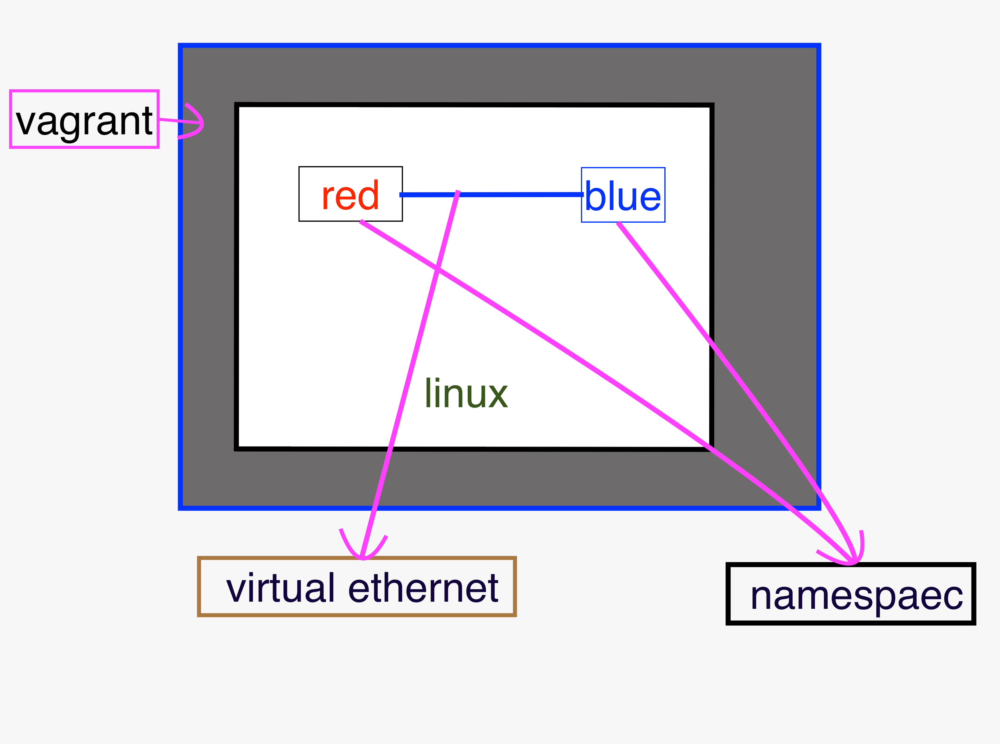
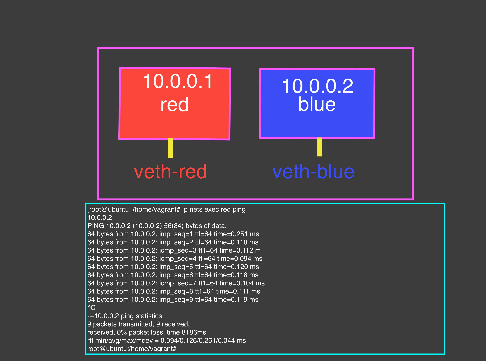

# Two-Namespaec-create-add-try
### Linux network namespaces

Linux network namespaces are a Linux kernel feature allowing us to isolate network environments through virtualization. For example, using network namespaces, you can create separate network interfaces and routing tables that are isolated from the rest of the system and operate independently.

To understand namespaces easily, it is worth saying Linux namespaces are the basis of container technologies like Docker or Kubernetes.

    

# After all task task done the out put will be 

    

